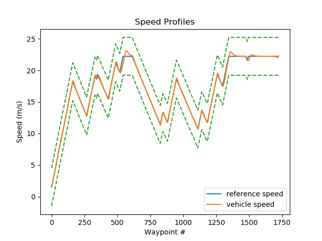

# Self-Driving Vehicle Control
This respository explains the approach implemented for the final project of the course, Introduction to Self-Driving Cars from the Self-Driving Cars Coursera Specialization.

The aim of this project was to implement a controller in Python to drive a car around a track in the Carla Simulator. To control successfully the vehicle, both longitudinal and lateral controllers were implemented, in order to obtain the throttle, brake and steering control signals.

## Tools
The tools used for this project were:
* Python
* Carla Simulatior

## Script
Access the [Python script](https://github.com/kmilo7204/Self-Driving_Vehicle_Control/blob/master/controller2d.py) of the project. The `controller2d.py` contains the implementation of both controllers. The outputs of each controller are sent to the script `module_7.py` which connects our controllers with the Carla Simulator.

All the files in this repository, should be added to the **PythonClient** folder in the Carla Simulator. To execute the script, please follow the next steps:

1. In one terminal and within the **Carla Simulator** folder, start the simulator at 30 Hz fixed-time step:
>CarlaUE4.exe /Game/Maps/RaceTrack -windowed -carla-server -benchmark -fps=30

2. In other terminal and under the **PythonClient** folder execute:
>python module_7.py

It will execute the script which contains the controllers.

>**Note:** The indications provided are oriented to Windows users.

## Controller
### Vehicle model
For explanatory purposes the Bicycle model is used to provide the reader an overview of how the lateral controller works and its implementation in this vehicle model.

>Image provided by coursera

### Longitudinal controller
For the vehicle longitudinal control, a PID controller was selected for two reasons: The first one was due to is easy implementation and tune, and the second one was due to the great results this controller provides in a wide range of systems.

The PID controller takes as input the error speed, defined as the difference between the desired speed and the current speed of the vehicle and outputs the throttle and the brake signals. The PID controller was implemented into a feedback architecture.

In this project, I avoided the use of a low level controller (After the PID) as the desired speed was relatively low and steady; nevertheless, for othe applications, a Feedforward controller could be implemented as well to obtain better results, but in this case not enough vehicle parameters were provided.

>**Note:** I used the Tustin discretization method to implement the PID controller in Python.

### Lateral controller
For the vehicle lateral control, the Stanley controller was selected due to its great performance and the huge amount of information found.

The Stanley controller uses the centre of the front axle as the reference point. It looks at both the error in heading (Heading error) and the error in position relative to the closest point on the path (Cross track error) to define an intituive steering law.

The next three steps were followed to implement successfully the controller:

1. Firstly, using the front axle coordinates and the closest waypoint coordinates to the vehicle, I calculated the Cross track error.

2. To estimate the Heading error, I calculated the current angle of the road (Using the current and the next waypoint), then, to this same value, I substracted the current yaw angle of the vehicle to obtain the Heading error.

3. Finally, to find the total steering angle I added both the Cross track and the Heading errors.

>Image provided by Coursera

### Results
#### Longitudinal control
To evaluate the performance of the longitudinal controller the next image is provided. In the graph, the speed profile proposed to drive the car around the track is in orange, and the real vehicle speed obtained by using the PID controller is in blue.

>During the whole trajectory, the controller provided the right outputs to the vehicle to mantain the desired speed within the proposed profile; however, at some point (between the 500 to 750 waypoints) the controller did not reach the desired speed, but a possible solution for this issue is to force a brake signal to reduce the speed in the corner.

#### Lateral control
Similar to the longitudinal controller, a image is provided to shown the performance of the lateral controller. In the graph, the trajectory proposed to drive the car around the car is shown in blue, and the trayectory followed by the vehicle by using the Stanley Controller is in orange.

>In this case, the vehicle followed the desired trajectory. The Stanley controller had a great performance overall and its precision was good enough for this case. 

Other types of controllers such as the Pure Pursuit or even the Model Predictive Control could be implemented to try to enhance the system performance.

## Video
Find a video with the final results of this project in this [link](https://www.youtube.com/watch?v=hDeEsH9pHK8)
